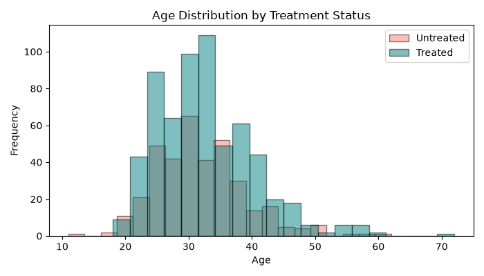
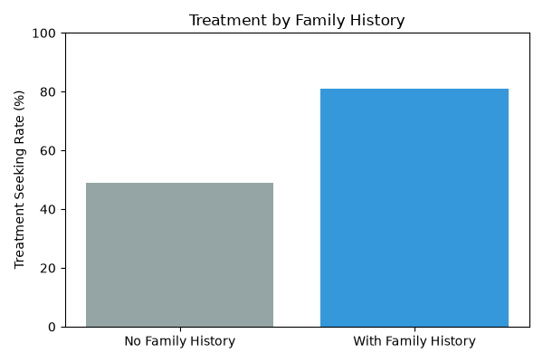
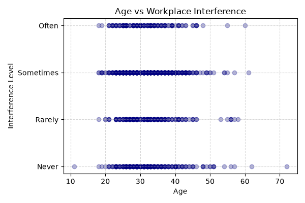

# Mental Health in Tech: Inferential Statistical Analysis

[](https://www.python.org/)
[](https://opensource.org/licenses/MIT)
[](https://github.com/psf/black)

An empirical study applying parametric, non-parametric, and categorical inferential statistics to evaluate behavioral and demographic determinants of mental health treatment in the technology sector.

---

## Executive Summary

Mental health awareness within high-stress engineering environments is a pivotal operational concern. Using empirical data from the Open Sourcing Mental Illness (OSMI) survey ($N = 1,259$ responses), this study formulates and tests three targeted statistical hypotheses examining age, hereditary factors, and self-reported workplace impairment:

1. **Family history is the strongest behavioral determinant:** Tech workers with a family history of mental health conditions are **31.8 percentage points more likely** to seek professional treatment ($80.9\%$ vs. $49.1\%$, $p < 10^{-24}$).
2. **Age does not dictate treatment adherence:** While treated professionals are marginally older on average (32.6 vs. 31.8 years), this variance is **not statistically significant** at the $\alpha = 0.05$ threshold ($t = 1.7788, p = 0.0757$).
3. **Workplace interference is age-invariant:** Perceived interference of mental conditions with daily tasks exhibits no meaningful correlation with participant age ($r = -0.0396, p = 0.2133$).

---

## Key Statistical Findings

| Hypothesis | Null Hypothesis ($H_0$) | Statistical Test | Test Statistic | $p$-value | Decision ($\alpha=0.05$) |
| :--- | :--- | :--- | :--- | :--- | :--- |
| **$H_1$: Age vs. Treatment** | $\mu_{\text{treated}} = \mu_{\text{untreated}}$ | Welch's Two-Sample $t$-test | $t = 1.7788$ | $p = 0.0757$ | Fail to Reject $H_0$ |
| **$H_2$: Family History Impact** | $p_{\text{history}} = p_{\text{no-history}}$ | Proportion CI & $\chi^2$ Test | $\chi^2 = 105.89$ | $p = 7.81 \times 10^{-25}$ | **Reject $H_0$** |
| **$H_3$: Age vs. Interference** | $\rho_{\text{Age, Interference}} = 0$ | Pearson ($r$) & Spearman ($\rho$) | $r = -0.0396$ | $p = 0.2133$ | Fail to Reject $H_0$ |

---

## Detailed Methodology & Hypothesis Testing

### Data Hygiene & Preprocessing
* Raw survey instances: **1,259**.
* Outlier exclusion: Filtered respondents outside standard working ages ($10 < \text{Age} < 100$).
* Complete-case analysis across core features (`Age`, `Gender`, `treatment`, `family_history`, `work_interfere`): **$n = 990$**.

---

### Hypothesis 1: Influence of Age on Seeking Treatment
* **Question:** Do tech professionals who seek mental health care differ systematically in age from those who do not?
* **Method:** Two-sample Welch's $t$-test (unpooled variance).
* **Metrics:** 
  * Treated ($n = 628$): $\bar{x} = 32.61$ years
  * Untreated ($n = 362$): $\bar{x} = 31.76$ years
* **Inference:** $t = 1.7788, p = 0.0757$. Because $p > 0.05$, we fail to reject the null hypothesis. Age is not a primary driver of treatment access.



---

### Hypothesis 2: Family History vs. Treatment Uptake
* **Question:** Does a family history of mental health conditions correlate with increased individual treatment seeking?
* **Method:** Normal approximation of binomial proportion 95% Confidence Intervals & Pearson's Chi-Square Test of Independence ($\text{df}=1$).
* **Metrics:**
  * With Family History ($n = 388$): $\hat{p} = 80.9\%$ (95% CI: $[77.3\%, 84.6\%]$)
  * Without Family History ($n = 602$): $\hat{p} = 49.1\%$ (95% CI: $[44.9\%, 53.3\%]$)
* **Inference:** The non-overlapping confidence intervals and $\chi^2 = 105.89$ ($p < 10^{-24}$) overwhelmingly reject $H_0$. Familial background significantly correlates with seeking care.



---

### Hypothesis 3: Age vs. Workplace Interference
* **Question:** Do younger tech workers perceive higher rates of work disruption caused by mental health conditions?
* **Method:** Pearson's linear correlation coefficient ($r$) accompanied by Spearman's rank-order correlation ($\rho$) for ordinal Likert responses (*Never* = 0, *Rarely* = 1, *Sometimes* = 2, *Often* = 3).
* **Metrics:**
  * Pearson: $r = -0.0396, p = 0.2133$
  * Spearman: $\rho = -0.0245, p = 0.4419$
* **Inference:** We fail to reject $H_0$. Mental health interference spans evenly across all seniorities and age demographics.



---

## Getting Started

### Prerequisites
* Python 3.9 or higher

### Installation

1. Clone this repository:
   ```bash
   git clone [https://github.com/](https://github.com/)<your-username>/mental-health-tech-analysis.git
   cd mental-health-tech-analysis

### Running the Interactive Notebook

If you prefer exploring the analysis with narrative commentary and inline interactive plots:

```bash
# Launch Jupyter Lab or Notebook
jupyter lab notebooks/mental_health_analysis.ipynb
